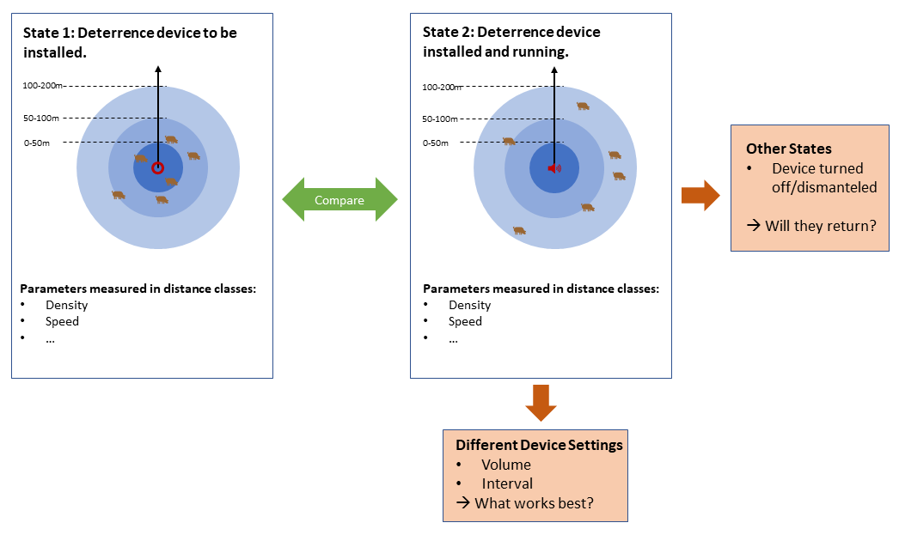

```{r, echo = FALSE, warning=FALSE, message=FALSE}

# You can set chunk options individually per code chunk, as was done with this
# code chunk.

# echo = FALSE           hides the code from the generated output
# warning = FALSE        hides warnings from the generated output
# message = FALSE        hides messages from the generated output

# To set the setting for all code chunks, use the following code:

knitr::opts_chunk$set(echo = TRUE, warning = FALSE, message = FALSE)

```


```{r, echo = FALSE}
library(devtools)
library(terra)
library(ggplot2)
library(tmap)
library(sp)
library(readr)
library(lubridate)
library(tidyverse)
library(tibble)
library(sf)
library(ComputationalMovementAnalysisData)
library(SpatialKDE)
library(RColorBrewer)
library(gridExtra)
```


# Abstract

<!-- the following is just a placeholder text, remove it!-->


# Introduction

Wild boar species spread across Eurasia and Africa and have also been introduced to the Americas. In many of these places, wild boars are considered pests as they cause great damage to crop fields. With too few natural predators left and humans struggling to control their numbers by the means of hunting, population has drastically increased in the past decades which also lead to increased crop damage (CITATION NEEDED). The reason is the large food supply and the mild climate together with the combination of the extraordinarily high reproductive capacity. Wild boar can cause great damage in agriculture. In particular, agricultural areas that are in the area of influence of protected areas are particularly affected by wild boar damage (ZHAW 2018).

In a report of the ZHAW, electric fences and scare killings are mentioned as two classic prevention methods (Suter et al., 2018). Most farmers keep wild boars out of the field with an electric fence. The fence should be strung with three wires at a height of 20, 40 and 60 centimeters above the ground. Putting up electric fences works fine, but requires regular upkeep as boars are often smart enough to surpass them (Suter et. al, 2018). The use of chemical and biological agents also keeps the wild boar at bay. One example of this is Hukinol. The use of mineral and lime fertilizers, which contain elemental sulfur, also serve as preventive measures (agrarheute 2018 & BLW 2018).

Researchers at ZHAW (Zurich University of Applied Sciences) have thus developed with another method that works acoustically with loud sound emission that are supposed to scare the animals away from agricultural fields. This is called the "Wildschweinschreck" (meaning wild-boar-scarer). This system requires minimal maintenance and labour cost as it turns on automatically at night, only requiring occassional battery changes. Location data of tagged boars living in the area was used in order to assess the effectiveness of this device and to find out if boars sustainably avoid the area during and after the device is activated. Determining these effects using Computational Movement Analyis is the subject of this semester project. Using spatio-temporal analysis techniques we want to find out at which distances to the device the "Wildschweinschreck" remains effective. This is intended to be done by calculating different location and movement parameters aggregated in different range classes (eg. 0-50m, 50-100m ...) around the device when it is active and compare it to a state (eg. before, during, after) where the device is shut off. The density and step length of the boars within those range classes will act as the indicator whether the deterrence device has a lasting effect on the animal's movement patterns. To illustrate this method, we devised a conceptual model that should make the process more clear (Fig. 1). The range classes are spatial entities arranged in concentrical circles around the device location. Important to remember is that these circles do not intersect as that would include certain locations multiple times. Apart from the innermost circle, all the circles are donut-shaped with the smaller donut fitting snugly into the hole of the larger donut and so forth. The circle shape was chosen because of the way sound waves spread in two-dimensional space: Moving in all directions and losing enery exponentially. We expect that the influence of a running Wildschweinschreck on boar behavior will be less in range classes that are further away.

If the data is sufficient in quality and quantity, this model allows for expansion in many dimensions. For instance, one could differentiate between device settings (volume, activation frequency) or try to find out if the boars return when the deterrence device is no longer active. If there are additional parameters that would be interesting to compare, such as behavioral pattern models, it could also be easily implemented. This initial analysis will be limited to basic movement parameters such as step length and fix density.

```{r pressure, echo=FALSE, fig.cap="Fig. 1: The conceptual model used for this analysis.", out.width = '100%'}

```

For our project, there are two main research questions. These are:
1. How does the movement of the boars change in close and far range of the device? Compare different movement parameters (density, speed) between device present/not present. 
2. At what ranges does the device effects the movement patterns on a macroscopic scale (across all device locations) and how significant are those differences? 

It is expected that step length and density will significantly decrease in the close range of the active device. In the mid range, it is expected that this difference will be very much less significant and that there will be no difference in the far range. In the final report of the ZHAW Wildschweinschreck-project it could be proven with Computational Movement Analysis that individual wild boar did in fact avoid a field equipped with a deterrence device. However, the report does not contain a macroscopic analysis across all individuals and locations with CMA. On this scale, the researchers assessed the impact by measuring the severity of additional damage after activation for the fields with a risk of damage. This analysis showed that 24% of all fields sustained medium to severe additional damage even though the device was running (Suter et al., 2018). This indicates that individual differences between animals and external factors might affect the outcome. Knowing this, it will be interesting to find out if the hypothesis will still stand in the end.

## Study Area
The study area of this data analyisis is called "Fanel" and lies in the "Drei-Seen-Land" in the western part of Switzerland between Lake Biel and Lake Neuchatel, just north of Lake Murten. It consists of small villages surrounded by agricultural fields, forests and wetlands. As part of a research project conducted by the Zurich University of Applied Science (ZHAW) it was one of five areas chosen to demonstrate and research the effects of a newly developed acoustic "Wildschweinschreck" deterrence device against wild boars. It was chosen because it is a suitable habitat for wild boar and, because of its proximity to agricultural fields, an area with a high incidence of wild boar damages to crops. On 46 fields, the Wildschweinschreck was installed and tested between 2013-2017 (Suter et al., 2018).


## The Data

### Movement Data 

The movement data was collected by using GPS transponders on a collar that were put on wild boar captured by tranquilizer gun or wildlife traps. In all of the study areas, 36 wild boar were equipped with a tracking device fitted to a collar and location data was gathered between 2014 and 2017 (Suter et al. 2018). 

### Deterrence Device Data 

In addition to the raw movement data spatio-temporal information of the devices were needed for this analysis. This consists of a list with all the locations and further information about the device setup (e.g installation height) and about the fields they were placed in (e.g. crop type, place name etc). Another list contains the time intervals these devices were active and detailed information about the chosen device settings, such as volume, direction and interval. The list with the time intervals is longer than the location list (69 to 57) because at some locations the device was activated multiple times. By joining these two table we received a single table containing all the instances this device was activated with both the location and time data, which is the minimum needed for this analysis to work. 


# Material and Methods

## Packages used

Prominently used in this project are the tidyverse, lubridate, sf, tmap, and ggplot packages.

## Datasets used

For this analysis we used the datasets provided by our course tutors. Naturally, we needed all the boar location data of the survey area which could conveniently be loaded into the R-scripts with the provided "ComputationalMovementAnalysis"-package. Similarly, the wss_locations and the agenda were loaded into our initial data processing and filtering script.

```{r}
head(schreck_agenda)
head(schreck_locations)
head(wildschwein_BE)
```

## Pre-Processing

The Wildschweinschreck locations first needed to be reprojected as they initally were provided in the WGS 84 geometric projection. The LV95 metric coordinates were then written into two seperate columns, E and N. In the next step, the locations were joined with the agenda. As some devices were activated multiple times at the exact same location, there are more entries in the agenda-table and thus the joined table has more entries than the original location table. A filter was applied to remove the deterrence devices activated in late Fall, Winter and early Spring. We wanted to observe the behavior of individuals during the vegetation period set between May and September. As the Wildschweinschreck serves to protect crops so it is sensible to filter it this way.

```{r}

#Step 1: Preprocessing the Wildschweinschreck location data

locations_sf <- st_as_sf(schreck_locations, coords = c('lon', 'lat'), crs = 4326)

#Reprojecting to LV95 metric coordinates
lv95_coords <- locations_sf%>%
  st_transform(crs = 2056)%>%
  mutate(E = st_coordinates(.)[,1],
         N = st_coordinates(.)[,2])

#Joining agenda and locations and filtering by date
joined_tables_device_locs <- left_join(lv95_coords, schreck_agenda , by = c("id" = "id"))%>%
  mutate(datum_on = as_datetime(paste(as.character(datum_on), " 00:01:00")),
        datum_off = as_datetime(paste(as.character(datum_off), " 00:01:00")))%>%
  filter(as.integer(month(datum_on)) >= 5  &  as.integer(month(datum_on)) <= 9)

joined_tables_device_locs <- st_set_geometry(joined_tables_device_locs, NULL)

```

The boar location data set contains more than 300'000 entries or location fixes in its raw form and not all of them are of use for this analysis. Here we also applied a filter to remove all the day time fixes, as boars typically feed in the cover of the night and the Wildschweinschreck devices were also only active after dark. Secondly, the fixes between November and March were excluded, this was done for the same reason as for the WSS location data, a longer time frame was included however, so that there were definitely enough fixes to compare the before and after state with the active state for all the device locations. This filtering left us with still more than 100'000 fixes to work with. For the remaining data velocity and steplength was calculated for each location, this gives us another movement variable to work with other than point density.

```{r}
#Step 2: Filter the boar location data and calculate speed and steplength
boar_locs_filtered <- wildschwein_BE%>% 
  filter(hour(DatetimeUTC) <= 6  |  hour(DatetimeUTC) >= 20)%>% 
  filter(month(DatetimeUTC) >= 4 & month(DatetimeUTC) <= 10)%>%
  group_by(TierName)%>%
  mutate(timelag = as.integer(difftime(lead(DatetimeUTC), DatetimeUTC, units = "secs")),
         steplength = sqrt((E- lead(E,1))^2 + (N -lead(N,1))^2),
         speed = as.numeric(round(steplength/timelag, 2)))

``` 
## Data and Study Area Overview

```{r, echo = FALSE}
hex_grids <- function(geom, extent, cell_size){
  
  grid <- extent%>%
    create_grid_hexagonal(cell_size = cell_size)%>%
    st_sf()%>%
    mutate(id_hex = 1:n())%>%
    dplyr::select(id_hex, geometry)
  
  grid_geom_joined <- st_join(geom, grid)
  grid_count <- grid_geom_joined%>%
    st_drop_geometry()%>%
    count(id_hex)
  
  hex_grid_geom <- grid%>%
    left_join(grid_count)#%>%
  #filter(!is.na(n))
  
  hex_grid_geom[is.na(hex_grid_geom)] <- 0
  
  return(hex_grid_geom)
}

wss_geom <- joined_tables_device_locs%>%
  st_as_sf(coords = c("E", "N"), crs = 2056)%>%
  distinct(id, .keep_all= TRUE) #Removing duplicate locations


boar_geom <- st_as_sf(boar_locs_filtered, coords = c("E", "N"), crs = 2056)
boar_bbox <- st_as_sf(st_make_grid(boar_geom, n = 1))

grid_boars <- hex_grids(boar_geom, boar_bbox, 200)%>%
  filter(n != 0)

tmap_mode("view")
tmap_style("cobalt")

tm_shape(grid_boars)+
  tm_fill(col = "n",
          palette = "viridis",
          style = "kmeans",
          alpha = 0.3,
          id = "n"
          )+
tm_shape(wss_geom)+
  tm_dots(col = "red",
          id = "id",
          popup.vars = c(
            "Region:" = "region",
            "Place Name:" = "flurname",
            "Crop:" = "kultur")
          )
 
```

## Processing

As the data was now ready, the algorithm for our analysis could be implemented. We first planned to use geometric operations with spatial features, but as our calculations are mostly based around distance measures, we were able to get by with simple pythagorean math. As a first step, a distance calculation function was defined to make the following code a bit more tidy. Then, the desired range parameters in metres are defined. It is not trivial to choose appropriate range classes. To not just define them arbitrarily, we used numbers from the ZHAW report. At 50 meters the device exceeded the 55dB legal threshold 100% of the time, at 500 meters this sinks to 20% and at 1500 meters the device is not audible anymore (Suter et al. 2018). We expect that that the density and step length of boar would not significantly change in the outermost class but the differences should become more significant the closer we move to the device. It should be noted that these measures are based on human hearing and we are aware that they possibly differ in boars. As we did not find similar information on swine sensory perception, this is the best we could do. How the amount and size of range classes change the outcome of such a study would also be interesting to find out, but goes beyond the scope of our study unfortunately. However, by changing the parameters in the following code block one can experiment with different distances and compare the outcome manually.

```{r}

#Defining functions
wss_distance <- function(x1, y1, x2, y2){
  sqrt((x1-x2)^2+(y1-y2)^2)
} 

  
#Defining distance parameters in metres
r1 = 50
r2 = 500
r3 = 1500

#Reading in pre-processed data
wss_data <- joined_tables_device_locs
boar_data <- boar_locs_filtered

```

## The Algorithm

What sounds complicated at first is in fact quite simple. Before the calculation begins, the areas of the range classes are calculated, again using simple geometric area functions. Three circles are calculated according to the range class input, then the area of the second biggest circle gets subtracted by the area of the biggest circle and-so-forth. In the end we receive the area in hectares of the donut-shaped range classes around each device. This will be handy for later statistics such as density measures. For the results of our algorithm, some empty columns are created; The n- prefix stands for absolute amount, rho- prefix representing relative density and the meansl- stands for mean steplength. These will be filled up later on.

```{r}

#area sizes of range classes in ha
area_r1 <- round(((r1^2*pi) / 10000), 3)
area_r2 <- round((((r2^2*pi) - area_r1) / 10000), 3)
area_r3 <- round((((r3^2*pi) - (r2^2*pi)) / 10000), 3)

#add columns for the results of the calculations
wss_data <- wss_data %>%
  add_column(r1 = r1,
             r2 = r2,
             r3 = r3,
             a_r1 = area_r1,
             a_r2 = area_r2,
             a_r3 = area_r3,
             n_r1_on = 0,
             n_r2_on = 0,
             n_r3_on = 0,
             rho_r1_on = 0,
             rho_r2_on = 0,
             rho_r3_on = 0,
             meansl_r1_on = 0,
             meansl_r2_on = 0,
             meansl_r3_on = 0)
```

The core range-class algorithm consists of a single loop that iterates through the WSS location table rows. Based on the information (location coordinates, time of activation/shutdown) contained in each row about the corresponding location, the large boar location dataset is manipulated. For each iteration, the data is filtered for the time interval during which the device was running, then the euclidian distance of these fixes to the respective device location is calculated and written into the boar location table. 

Based on these distances, the boar location dataset can be subsetted based on the distance ranges provided in the beginning. The number of fixes in each range class is counted and written into the corresponding data field of the Wildschweinschreck table. With the area of each range class it is also possible to calculate the density of the fixes. This is then divided by the number of days the device was active, so the densities are more  comparable with each other since every device on the schedule runs for a different amount of time. The data in the rho- fields thus is in the unit of fixes per hectare and day. The same is done with the steplength, though in this case the mean over all fixes is written into the respective column.

```{r}
for (i in 1:nrow(wss_data)){
  E_wss <- wss_data$E[i]
  N_wss <- wss_data$N[i]
  wss_start <- wss_data$datum_on[i]
  wss_end <- wss_data$datum_off[i]
  n_days <- as.numeric(difftime(wss_end, wss_start, units = "days"))
  
  boar_data_filtered <- boar_data%>%
    filter(DatetimeUTC >= wss_start & DatetimeUTC <= wss_end)%>%
    mutate(dist = wss_distance(E_wss, N_wss, E, N))
  
  fixes_r1 <- boar_data_filtered%>%
    filter(dist <= r1)
  fixes_r2 <- boar_data_filtered%>%
    filter(dist > r1 & dist <= r2)
  fixes_r3 <- boar_data_filtered%>%
    filter(dist > r2 & dist <= r3)
  
  #number of fixes in each range class and specified time interval
  wss_data$n_r1_on[i] <- nrow(fixes_r1)
  wss_data$n_r2_on[i] <- nrow(fixes_r2)
  wss_data$n_r3_on[i] <- nrow(fixes_r3)
  
  #boar density per hectare and day, to make relative numbers comparable
  wss_data$rho_r1_on[i] <- round((wss_data$n_r1_on[i]/area_r1)/n_days, 2)
  wss_data$rho_r2_on[i] <- round((wss_data$n_r2_on[i]/area_r2)/n_days, 2)
  wss_data$rho_r3_on[i] <- round((wss_data$n_r3_on[i]/area_r3)/n_days, 2)
  
  #Mean steplength
  wss_data$meansl_r1_on[i] <- mean(fixes_r1$steplength)
  wss_data$meansl_r2_on[i] <- mean(fixes_r2$steplength)
  wss_data$meansl_r3_on[i] <- mean(fixes_r3$steplength)
  }

```

Despite the seemingly vast amount of location data, many boars seemed not to have been in the right place at the right time, as most range classes did not contain any fixes at all. These are of no use to our analysis and need to be discarded. This leaves only eight out of the initial 61 WSS locations to work with. 

```{r}

#filtering data entries with no boar locations in r1, r2 and r3
wss_data <- wss_data%>%
  filter(n_r1_on != 0 & n_r2_on != 0 & n_r3_on != 0)

head(wss_data)
```

Now we need a "control group" to compare against, that represents the boar movement without the effects of a deterrence device. For this we used a timeframe of the same length as the active state of each device (datum_off - datum_on) but immediately before device activation. The temporal closeness was chosen to keep as many factors as possible constant, such the as the season, presence of the same individuals and a similar food supply. Of course there are some insecurities because of this and other factors that might influence boar behavior.

Some more columns were created for the data to be written in and some temporal parameters were changed. Apart from the that, the same loop was run another time and also provided the same stats for this time frame. 


```{r}

#Running the algorithm for time before switched on
wss_data <- wss_data %>%
  add_column(n_r1_bon = 0, # -bon suffix stands for "before on"
             n_r2_bon = 0,
             n_r3_bon = 0,
             rho_r1_bon = 0,
             rho_r2_bon = 0,
             rho_r3_bon = 0,
             meansl_r1_bon = 0,
             meansl_r2_bon = 0,
             meansl_r3_bon = 0)


for (i in 1:nrow(wss_data)){
  E_wss <- wss_data$E[i]
  N_wss <- wss_data$N[i]
  wss_start <- wss_data$datum_on[i] - as.numeric(wss_data$datum_off[i] - wss_data$datum_on[i])*86400 #using the same time interval for before as during device activation
  wss_end <- wss_data$datum_on[i]
  n_days <- as.numeric(difftime(wss_end, wss_start, units = "days"))
  
  boar_data_filtered <- boar_data%>%
    filter(DatetimeUTC >= wss_start & DatetimeUTC <= wss_end)%>%
    mutate(dist = wss_distance(E_wss, N_wss, E, N))
  
  fixes_r1 <- boar_data_filtered%>%
    filter(dist <= r1)
  fixes_r2 <- boar_data_filtered%>%
    filter(dist > r1 & dist <= r2)
  fixes_r3 <- boar_data_filtered%>%
    filter(dist > r2 & dist <= r3)
  
  #number of fixes in each range class and specified time interval
  wss_data$n_r1_bon[i] <- nrow(fixes_r1)
  wss_data$n_r2_bon[i] <- nrow(fixes_r2)
  wss_data$n_r3_bon[i] <- nrow(fixes_r3)
  
  #boar density per hectare and day
  wss_data$rho_r1_bon[i] <- round((wss_data$n_r1_bon[i]/area_r1)/n_days, 2)
  wss_data$rho_r2_bon[i] <- round((wss_data$n_r2_bon[i]/area_r2)/n_days, 2)
  wss_data$rho_r3_bon[i] <- round((wss_data$n_r3_bon[i]/area_r3)/n_days, 2)
  
  #Mean steplength
  wss_data$meansl_r1_bon[i] <- mean(fixes_r1$steplength)
  wss_data$meansl_r2_bon[i] <- mean(fixes_r2$steplength)
  wss_data$meansl_r3_bon[i] <- mean(fixes_r3$steplength)
}

head(wss_data)

```


## Overview
In a first step, an overview of the data is given. This should help make the data understandable.
```{r}
ggplot(boar_locs_filtered, aes(DatetimeUTC,TierID)) +
  geom_line()

boar_locs_filtered%>%
  ggplot(aes(E, N)) +
  geom_path() +
  geom_point() +
  coord_fixed() +
  theme(legend.position = "bottom")

joined_tables_device_locs%>%
  ggplot(aes(E, N, col="lautstaerke")) +
  geom_path() +
  geom_point() +
  coord_fixed() +
  theme(legend.position = "bottom")

ggplot(boar_locs_filtered, aes(x =moonilumination , y = speed)) +
  geom_point(mapping=aes(x= moonilumination , y = speed, color= TierName)) +
  stat_smooth(method = "lm")
```


# Results

To compare and quantify our results we opted for a Student's t-test and visualisation with boxplots. Here we will not look at any single Wildschweinschreck device, but look at all of them together and compare the density of fixes and the mean step length between the range classes before and during the device is running. The t-test was chosen as it helps us be more sure if the differences we are seeing are significant and not just happening by chance, by taking the sample size and variance into account the t-test gives us more insight than a simple visual comparison using boxplots.

The type of t-test used is a two-sided paired sample t-test. Paired sample t-test are used when the same subject under different conditions is compared to itself instead of two unrelated groups. As we are comparing the same range classes at the same locations to each other, with the only difference between them being the activation status of the Wildschweinschreck, this test seemed appropriate. Our null hypothesis states that the means remain the same between the two groups.

```{r}

#Changing data table to long format
wss_data_long <- wss_data%>%  
            pivot_longer(c('meansl_r1_on',
                           'meansl_r2_on',
                           'meansl_r3_on',
                           'meansl_r1_bon',
                           'meansl_r2_bon',
                           'meansl_r3_bon',
                           'rho_r1_on',
                           'rho_r2_on',
                           'rho_r3_on',
                           'rho_r1_bon',
                           'rho_r2_bon',
                           'rho_r3_bon'), 
                          names_to = "name", values_to = "value")


#T-tests mean steplength [m]

#range class one
steplength_r1_on <- wss_data$meansl_r1_on
steplength_r1_bon <- wss_data$meansl_r1_bon
t.test(x = steplength_r1_on, y = steplength_r1_bon, paired = TRUE, conf.level = 0.95)

bp <- filter(wss_data_long, name == "meansl_r1_on" | name == "meansl_r1_bon")
gg1 <- ggplot(bp)+
        geom_boxplot(aes(name, value, color = name), na.rm = TRUE, outlier.shape = NA, show.legend = FALSE)+
        geom_jitter(aes(name, value, color= name), size=1.5, alpha=0.9, show.legend = FALSE) +
        #labs(title = "Steplength comparison between range class 1 under different WSS status")+
        ylab("Steplength [m]")+
        xlab("Activation status [on/before-on]")


#range class two
steplength_r2_on <- wss_data$meansl_r2_on
steplength_r2_bon <- wss_data$meansl_r2_bon
t.test(x = steplength_r2_on, y = steplength_r2_bon, paired = TRUE, conf.level = 0.95)

bp <- filter(wss_data_long, name == "meansl_r2_on" | name == "meansl_r2_bon")
gg2 <- ggplot(bp)+
        geom_boxplot(aes(name, value, color = name), na.rm = TRUE, outlier.shape = NA, show.legend = FALSE)+
        geom_jitter(aes(name, value, color= name), size=1.5, alpha=0.9, show.legend = FALSE) +
        #labs(title = "Steplength comparison between range class 2 under different WSS status")+
        ylab("Steplength [m]")+
        xlab("Activation status [on/before-on]")
  
#range class three
steplength_r3_on <- wss_data$meansl_r3_on
steplength_r3_bon <- wss_data$meansl_r3_bon
t.test(x = steplength_r3_on, y = steplength_r3_bon, paired = TRUE, conf.level = 0.95)

bp <- filter(wss_data_long, name == "meansl_r3_on" | name == "meansl_r3_bon")
gg3 <- ggplot(bp)+
        geom_boxplot(aes(name, value, color = name), na.rm = TRUE, outlier.shape = NA, show.legend = FALSE)+
        geom_jitter(aes(name, value, color= name), size=1.5, alpha=0.9, show.legend = FALSE) +
        #labs(title = "Steplength comparison between range class 3 under different WSS status")+
        ylab("Steplength [m]")+
        xlab("Activation status [on/before-on]")

grid.arrange(gg1, gg2, gg3, ncol = 3)

```

When comparing the step length between before switching on the device and during its runtime, there is no significant difference in range classes r2 and r3. In range class r1 however, the p value is ever so slightly smaller than the significance level of 0.05, indicating a significant difference between the two means. One might think this will support our thesis that close proximity to the deterrence device leads to a longer steplength, but it was actually the opposite. Before device activation the step length was actually higher then during activation. We assumed that boars would only be passing when the Wildschweinschreck would run, therefore increasing their step length.


```{r, echo = FALSE}
#T-tests rho [number of fixes per ha and day]

#range class one
rho_r1_on <- wss_data$rho_r1_on
rho_r1_bon <- wss_data$rho_r1_bon
t.test(x = rho_r1_on, y = rho_r1_bon, paired = TRUE, conf.level = 0.95)

bp <- filter(wss_data_long, name == "rho_r1_on" | name == "rho_r1_bon")
gg4 <- ggplot(bp)+
        geom_boxplot(aes(name, value, color = name), na.rm = TRUE, outlier.shape = NA, show.legend = FALSE)+
        geom_jitter(aes(name, value, color= name), size=1.5, alpha=0.9, show.legend = FALSE) +
        #labs(title = "Comparison of fix density between range class 1 under different WSS status")+
        ylab("Mean density [n_fixes/ha/day]")+
        xlab("Activation status [on/before-on]")

#range class two
rho_r2_on <- wss_data$rho_r2_on
rho_r2_bon <- wss_data$rho_r2_bon

t.test(x = rho_r2_on, y = rho_r2_bon, paired = TRUE, conf.level = 0.95)


bp <- filter(wss_data_long, name == "rho_r2_on" | name == "rho_r1_bon")
gg5 <- ggplot(bp)+
        geom_boxplot(aes(name, value, color = name), na.rm = TRUE, outlier.shape = NA, show.legend = FALSE)+
        geom_jitter(aes(name, value, color= name), size=1.5, alpha=0.9, show.legend = FALSE) +
        #labs(title = "Comparison of fix density between range class 2 under different WSS status")+
        ylab("Mean density [n_fixes/ha/day]")+
        xlab("Activation status [on/before-on]")

#range class three
rho_r3_on <- wss_data$rho_r3_on
rho_r3_bon <- wss_data$rho_r3_bon

t.test(x = rho_r3_on, y = rho_r3_bon, paired = TRUE, conf.level = 0.95)

bp <- filter(wss_data_long, name == "rho_r3_on" | name == "rho_r3_bon")
gg6 <- ggplot(bp)+
        geom_boxplot(aes(name, value, color = name), na.rm = TRUE, outlier.shape = NA, show.legend = FALSE)+
        geom_jitter(aes(name, value, color= name), size=1.5, alpha=0.9, show.legend = FALSE) +
        #labs(title = "Comparison of fix density between range class 3 under different WSS status")+
        ylab("Mean density [n_fixes/ha/day]")+
        xlab("Activation status [on/before-on]")

grid.arrange(gg4, gg5, gg6, ncol = 3)


```
In the comparison of the fix density per hectare and day 


## Visualisation of the Results

To visualise the spatial distribution of our results, it was decided to map the boar fixes, the Wildschweinschreck-locations and their range classes using tmap. The boar location data is filtered based on the chosen deterrence device and their run time similar to the algorithm used for the analysis. Then a point geometry data set is created. The idea here is to create a vector feature grid and count  the amount of fixes within each cell for the specified period. This creates a density map, which gives a rough idea where the boars were located at that time.

We chose a hexagonal grid initially for the visual appeal and our admiration of bees, but we later learned that this is a superior model for our purposes, especially when working with movement paths (Birch et al., 2007). A spatial join was done with those two geometries, counting the number of fixes in each hexagonal tile. This was done for both operation states (during and before) and these were then subtracted from each other (during - before) to show the possible effects of the deterrence device.

In order to visualise the Wildschweinschreck-locations buffers with the corresponding radius were calculated to give a sense of scale for the range classes in comparison to the study area. The exact location of the device will be represented by a point feature. When hovering over it should provide all necessary information about from previous calculations. Initially it was planned to integrate this plot with shiny to make it more interactive. But tmap proved quite cumbersome to implement with shiny, which lead to ambiguous outcomes. Because of this, the default device chosen is number 3 at Tannenhof as it had high density of boars in its range classes. If one wants to look at another device, it is advised to change the parameter "device_number" in the RMarkdown file. 
```{r}

wss_data <- wss_data%>%
  mutate(num = c(1:nrow(wss_data)),
          id = paste(as.character(num), ":", " ", flurname, sep = ""))

#functions
hex_grids <- function(geom, extent, cell_size){
  
  grid <- extent%>%
    create_grid_hexagonal(cell_size = cell_size)%>%
    st_sf()%>%
    mutate(id_hex = 1:n())%>%
    dplyr::select(id_hex, geometry)
  
  grid_geom_joined <- st_join(geom, grid)
  grid_count <- grid_geom_joined%>%
    st_drop_geometry()%>%
    count(id_hex)
  
  hex_grid_geom <- grid%>%
    left_join(grid_count)#%>%
    #filter(!is.na(n))
  
  hex_grid_geom[is.na(hex_grid_geom)] <- 0
  
  return(hex_grid_geom)
}


#Choose your values
wss_data

#Select the device by number
device_number <- 3

#Select cell size in metres (CAUTION: cell size < 100 takes a long time to calculate, < 50 not recommended)
cell_size <- 100


#converting to geometry
wss_geom <- wss_data%>%
  st_as_sf(coords = c("E", "N"), crs = 2056)%>%
  filter(num == device_number)

#Setting Buffers
rad1 = wss_geom$r1
rad2 = wss_geom$r2
rad3 = wss_geom$r3

wss_buffer1 <- st_buffer(wss_geom, dist = rad1)
wss_buffer2 <- st_buffer(wss_geom, dist = rad2)
wss_buffer3 <- st_buffer(wss_geom, dist = rad3)

#calculating difftime
start_date <- wss_geom$datum_on
end_date <- wss_geom$datum_off
n_seconds <- as.numeric(difftime(end_date, start_date, units = "secs"))

 
#honeycomb grid binning on and before on
boar_geom_on <- st_as_sf(boar_data, coords = c("E", "N"), crs = 2056)
boar_bbox <- st_as_sf(st_make_grid(boar_geom_on, n = 1))
boar_geom_on <- filter(boar_geom_on, DatetimeUTC >= start_date & DatetimeUTC <= end_date)

#change to before interval
end_date <- start_date
start_date <- start_date - n_seconds

boar_geom_bon <- boar_data%>%
  st_as_sf(coords = c("E", "N"), crs = 2056)%>%
  filter(DatetimeUTC >= start_date & DatetimeUTC <= end_date)


#Calculating hex-grid binning for both time intervals
grid_boars_on <- hex_grids(boar_geom_on, boar_bbox, cell_size)
grid_boars_bon <- hex_grids(boar_geom_bon, boar_bbox, cell_size)%>%
  st_drop_geometry()

grid_boars_join <- left_join(grid_boars_on, grid_boars_bon, by = c("id_hex" = "id_hex"), suffix = c(".on",".bon"))%>%
  mutate(diff_on_bon = n.on - n.bon)%>%
  filter(n.bon != 0 | n.on != 0)%>%
  select(id_hex, n.bon, n.on, diff_on_bon, geometry)
```
Below is a plot of device location 3 at Tannenhof. By clicking on the green dot in the center of the range classes some more information about the location is listed. Hovering over the vector tile displays the number of boar fixes in that area.
```{r, echo = FALSE}

#Setting up the visualisation
tmap_mode("view")
tmap_style("cobalt")

tm_shape(grid_boars_join)+
  tm_fill(col = "diff_on_bon",
              palette = brewer.pal(4, "RdBu"),
              style = "cont",
              midpoint = 0,          
              alpha = 0.7,
              id = "diff_on_bon"
              )+
tm_shape(wss_buffer1)+
  tm_borders(col = "grey",
          alpha = 0.7)+
tm_shape(wss_buffer2)+
  tm_borders(col = "grey", 
          alpha = 0.7)+
tm_shape(wss_buffer3)+
  tm_borders(col = "grey",
          alpha = 0.7)+
tm_shape(wss_geom)+
  tm_dots(col = "green",
          id = "id",
          popup.vars = c(
           "Region:" = "region",
            "Crop:" = "kultur",
            "Activation:" = "datum_on",
            "Deactivation:" = "datum_off",
            "Radius r1 [m]:" = "r1",
            "Radius r2 [m]:" = "r2",
            "Radius r3 [m]:" = "r3",
            "Area r1 [ha]" = "a_r1",
            "Area r2 [ha]" = "a_r2",
            "Area r3 [ha]" = "a_r3",
            "Density r1 before active:" = "rho_r1_bon",
            "Density r1 while active:" = "rho_r1_on",
            "Density r2 before active:" = "rho_r2_bon",
            "Density r2 while active:" = "rho_r2_on",
            "Density r3 before active:" = "rho_r3_bon",
            "Density r3 while active:" = "rho_r3_on",
            "Mean step length r1 before active:" = "meansl_r1_bon",
            "Mean step length r1 while active:" = "meansl_r1_on",
            "Mean step length r2 before active:" = "meansl_r2_bon",
            "Mean step length r2 while active:" = "meansl_r2_on",
            "Mean step length r3 before active:" = "meansl_r3_bon",
            "Mean step length r3 while active:" = "meansl_r3_on"
          ))
  

```
# Discussion

Wild boars use agricultural land the most for foraging. Potato fields were preferred by wild boars from mid-May to early June. The peaks of wild boar visits in wheat are from mid-May to late June and in maize from mid-July to mid-August. 
The growth of the wild boar population is promoted by the large food supply and free access to the agricultural areas.
This agrees well with the months of data filtering.However, there are fields in which the wild boars ignored the wild boar fright and could not be driven away, despite acoustic deterrence. There are therefore outliers in the method of action. Not all factors that are necessary for analysis have been taken into account. For example, the weather also plays a role. It is also not clear whether the harvests were the same every year. 

- Does not prove that device is not working:
  - Different factors need to be adjusted for
  - Macroscopic approach doesn't take individuals into account --> More (freuquent) data needed for each boar.
  - Microscopic approach might be better -> Fewer individuals, one or two WSS locations
  - Smaller timeframe -> weeks instead of months -> again not enough data
  - More fixes would improve uncertainties, putting WSS in places where tagged boars typically are.
  
- Combination of Circular and hexagonal model

# Bibliography
agrargeute (2018):Praktiker-Tipps: So halten Sie Wildschweine auf Abstand.<https://www.agrarheute.com/tier/rind/praktiker-tipps-so-halten-wildschweine-abstand-534838>
[Stand: 03.05.2018; Zugriff: 20.06.2021].

Bayerisches Landwirtschaftliches Wochenblatt (BLW) (2018): Wildschweinschäden-10 Massnahmen zur Vorbeuge.<https://www.wochenblatt-dlv.de/feld-stall/pflanzenbau/wildschweinschaeden-10-massnahmen-vorbeuge-541524>
[Stand: 04.01.2018; Zugriff: 20.06.2021].

Birch, Colin P.D. ; Oom, Sander P. ; Beecham, Jonathan A.: Rectangular and hexagonal grids used for observation, experiment and simulation in ecology. In: Ecological Modelling Bd. 206 (2007), Nr. 3–4, S. 347–359

Suter, Stefan ; Stoller, Sandro ; Sigrist, Benjamin: Prävention von Wildschweinschäden in der Landwirtschaft und Management von Wildschweinen in Schutzgebieten - Schlussbericht, 2018

